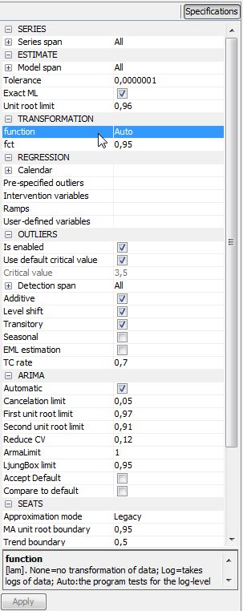
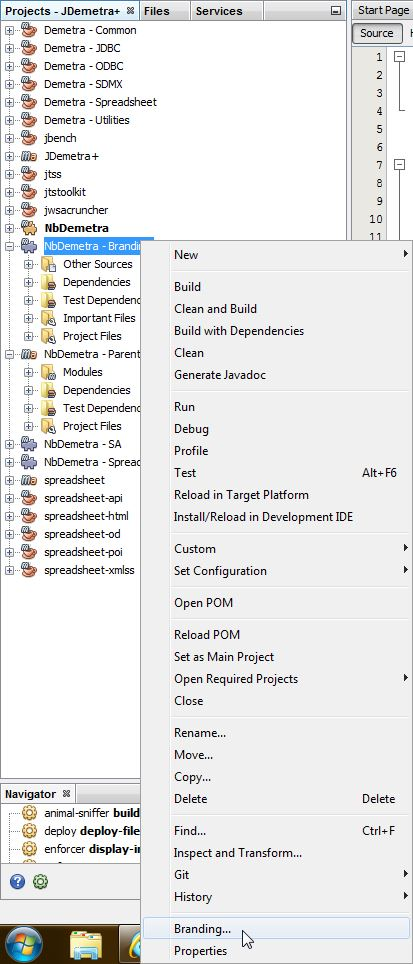
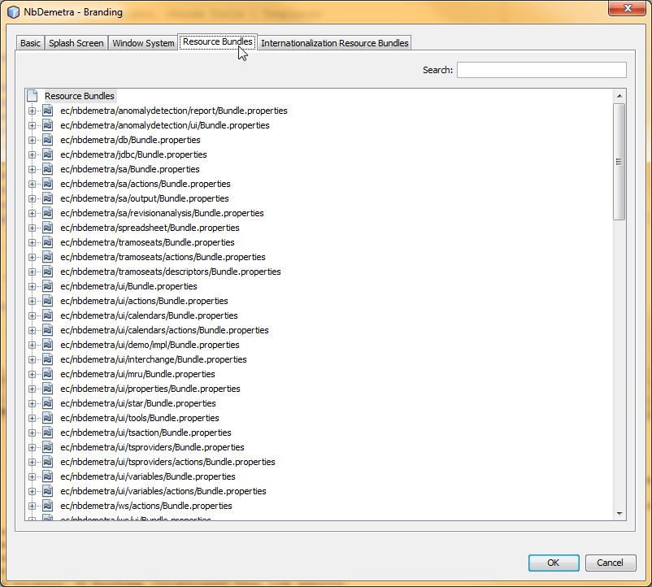
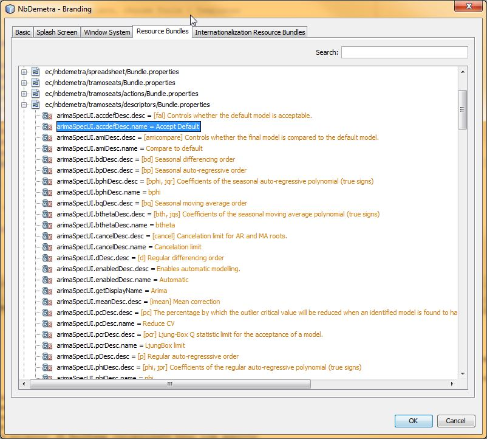
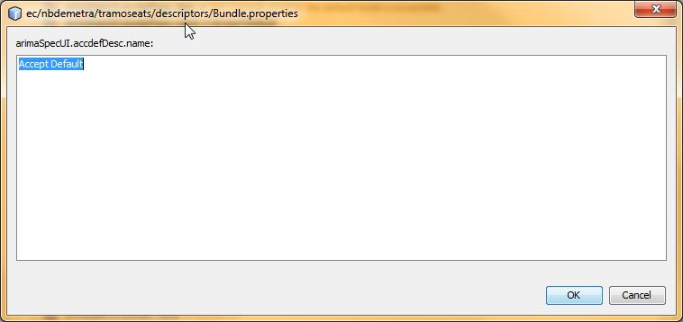

##How to modify JDemetra+ specifications properties messages?

###Context

Into the "Specification panel, all the properties could have an explanation about the impact they have at the bottom of the panel  
  

Actually those messages were coded inside the class files and could not be modified easily.

###Branding

With NetBeans, there is a way to externalize a string message by using the attribute `@Messages` of the [org.openide.util.NbBundle.Messages](http://bits.netbeans.org/dev/javadoc/org-openide-util/org/openide/util/NbBundle.Messages.html) class.

This attribute generate a `Bundle.properties` file for each package and create a pair of *key/value* element for each message to display. Then in your code, you use the key instead of your string.

Using the _Branding_ functionality of NetBeans will help you if you want to expand those properties messages.  
Basically you could modify only one (or many) messages without going inside the code. You can just change one message and the _Branding_ functionality will create a new `Bundle.properties` file that will contain the new key/value. This `Bundle.properties` file will contain one, many or all the *key/value* and will be use first in the replacement of the variables by your message.

###How to?

1.	Open the jdemetra-app project in NetBeans
2.	Right-Click on the NbDemetra – Branding project  
   
and click on *Branding…* menu
3.	Select *Resource Bundles* tab  

4.	You can search for a _key_ in the search textbox or double click on the `Bundle.properties` to access the different _key/value_ variables.  

5.	Double-click on the _key/value_ you want to modifie and write the new value you want to see.  

