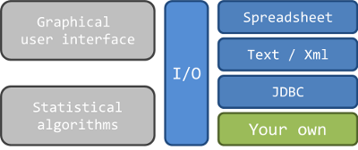

## About TS Providers

**The I/O operations** in JDemetra+ **are performed by**
specific modules called **time series providers**.

By default, JDemetra+ is bundled with a few useful
providers allowing you to retrieve data from several
sources such as spreadsheets and relational
databases.

From user perspective, JDemetra+ seems to be a
monolithic application designed to deal with seasonal
adjustment only but the inside code is quite different.
Actually, JDemetra+ is a **modular java application** that
allows you to **extend** its capabilities **and/or reuse** its
modules inside your own application.

Therefore, **JDemetra+ is not limited to the providers bundled in**. You can create and add your own.

## Getting started

To get started with the TS providers:

| Tool | How to get started |
| ---- | ------------------ |
| NetBeans IDE | Download the "Java SE" distribution of NetBeans IDE. This distribution contains all you need to build your own provider. |
| Command-line Maven | Maven is already integrated into NetBeans but you can download it as a standalone command-line tool. |
| Other IDEs | You can use any IDE that supports Maven-based projects. |  

## Main features

The purpose of a provider is to **browse and retrieve data** from a
data store. These operations are done by browsing a **hierarchical
structure** that handles two kind of objects:

1. a **DataSource**, an object that represents a source of data
such as a spreadsheet, a relational database, or any kind of
data store. It contains all the information needed to access
the source (path, url, some parameters...). A DataSource
does not contain data but only a reference to it.
2. a **DataSet**, an object that represents data in a DataSource
such as a peculiar column of a sheet of a spreadsheet. It
may represent either a collection or a time series. A DataSet
does not contain data but only a reference to it.

For example, the following figure shows a DotStat data source 
called "Reference exchange rates ..." which contains several collections themselves
containing several times series such as "Annual" or "Daily". 

Depending on the provider, the DataSources might appear
automatically or not. Most of the time, you have to add a new
DataSource by opening the context menu on the chosen provider
and clicking on the menu item named “Open”. This action will prompt
a configuration dialog.

Once you get your DataSource in the hierarchy, you can retrieve its data by selecting a DataSet and either:

- using the clipboard (usual copy/paste)
- performing a drag & drop
- double clicking on it

### A few tips

Here are a few tips that might simplify the user's work:

- The DataSources can be converted to a convenient XML text that can be stored and loaded to avoid the
configuration process.
- In the same idea, Demetra is able to remember the most recent used DataSources. Just open the
context menu on a provider to do it.
- If the DataSource is a file, you can drag & drop it directly on a provider. This will trigger the configuration
dialog.
- DataSources can be automatically opened at start up by opening the context menu on a DataSource
and clicking on the menu item named “Toggle star”. Repeat the operation to cancel it.
- A DataSource can be sent to a coworker by email. To do so, open the context menu and click on the
menu item named “Mail as xml”.

## TS Providers APIs

JDemetra+ provides a large set of APIs. You do not need to know or use all of them, just those that make sense in your specific context.

As for most of the APIs of JDemetra+, the engine (core) and the user interface (UI) are separated into different projets.

### Core API

The TS providers core API are located in the package [`ec.tss.tsproviders`](https://github.com/jdemetra/jdemetra-core/tree/develop/jtss/src/main/java/ec/tss/tsproviders) of the [`demetra-jtss`](https://github.com/jdemetra/jdemetra-core/tree/develop/jtss) project.
Here are the most important classes:
 
| Type | Description |
| ---- | ----------- |
| [DataSet](https://github.com/jdemetra/jdemetra-core/blob/develop/jtss/src/main/java/ec/tss/tsproviders/DataSet.java) | Structure that defines a set of data such as a time series or a collection. |
| [DataSource](https://github.com/jdemetra/jdemetra-core/blob/develop/jtss/src/main/java/ec/tss/tsproviders/DataSource.java) | Structure that defines a source of data such as a file, a database or any resource.  |
| [IDataSourceProvider](https://github.com/jdemetra/jdemetra-core/blob/develop/jtss/src/main/java/ec/tss/tsproviders/IDataSourceProvider.java) | Defines a provider that is used to discover and browse DataSources and DataSets. |
| [IDataSourceLoader](https://github.com/jdemetra/jdemetra-core/blob/develop/jtss/src/main/java/ec/tss/tsproviders/IDataSourceLoader.java) | Defines a provider whose content can be changed programmatically. |
| [IFileLoader](https://github.com/jdemetra/jdemetra-core/blob/develop/jtss/src/main/java/ec/tss/tsproviders/IFileLoader.java) | Defines a specialized provider whose source is a file. |

Note that the package [`ec.tss.tsproviders.utils`](https://github.com/jdemetra/jdemetra-core/tree/develop/jtss/src/main/java/ec/tss/tsproviders/utils) contains some useful classes that simplify the implementation of a provider.

### UI API

The TS providers core API are located in the package [`ec.nbdemetra.ui.tsproviders`](https://github.com/jdemetra/jdemetra-app/tree/develop/nbdemetra-ui/src/main/java/ec/nbdemetra/ui/tsproviders) of the [`nbdemetra-ui`](https://github.com/jdemetra/jdemetra-app/tree/develop/nbdemetra-ui) project.
Here are the most important classes:
 
| Type | Description |
| ---- | ----------- |
| [IDataSourceProviderBuddy](https://github.com/jdemetra/jdemetra-app/blob/develop/nbdemetra-ui/src/main/java/ec/nbdemetra/ui/tsproviders/IDataSourceProviderBuddy.java) | Customizes the UI elements of a provider such as the labels, icons and editors. |

### Lookup API

[Lookup](http://bits.netbeans.org/7.4/javadoc/org-openide-util-lookup/overview-summary.html) is a NetBeans Platform API that handles loosely coupled communication.
It is similar to but more powerful than the ServiceLoader class in JDK6.

It is used by JDemetra+ to get all providers available dynamically at runtime.

## Example

You can find an example of a random TS provider in the [JDemetra+ tutorial](https://github.com/nbbrd/jdemetra-tutorial).